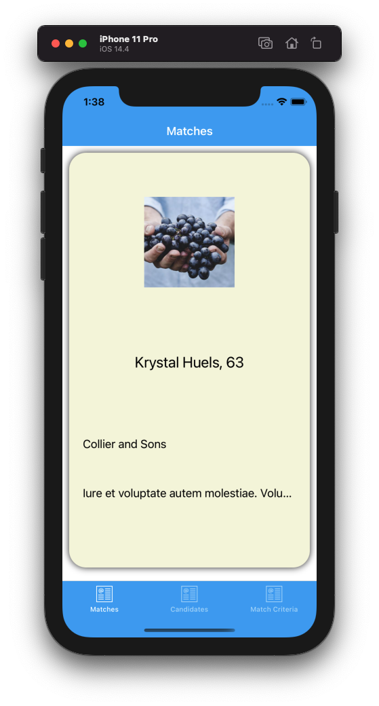
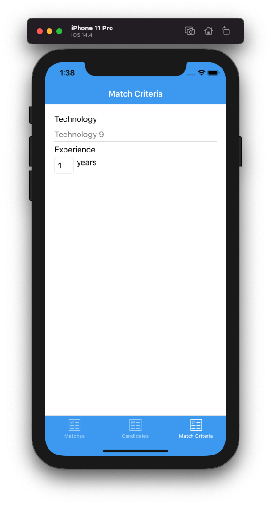
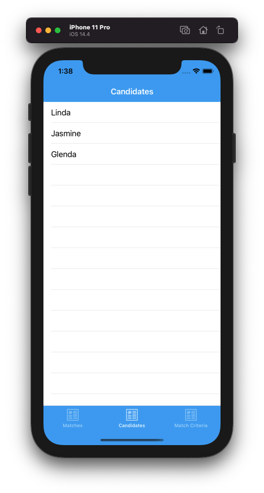

# Agent Recruiter

Work test from January, 2020 - Client app written in Xamarin.Forms.

It contains the app and models that represents the data received from the API.

Watch video [here](https://youtu.be/PwTOJAMI2eM). Screenshots below.

## The task

Read about the full task here: [INSTRUCTIONS.md](INSTRUCTIONS.md)

### TL;DR;
Match available agents based on skills and characteristics in a Tinder-like swipe interface - using the provided Web API as a data source.

### Note 

The original API seems to be down, so I guess this test is no longer used, and that it is OK to publish this code.

## Updates

The following has happened since the test:

* Dependencies have been updated.
* Created a Web API with fake data.

## Screenshots

### Swipe & Match view

### Search criteria

### Candidates

